---

🌍 **\[about\]** &nbsp; ML researcher and builder. From Virginia, currently based in The Bay 🌉.

🛰️ **\[studying\]** &nbsp; Computer Science, Chemical Biology & Aerospace Engineering at UC Berkeley.

🔭 **\[currently\]** &nbsp; 3D imaging & tumor sensing hardware at [The Anwar Lab](https://www.anwarlab.org/). Incoming research intern at [Microsoft Research](https://www.microsoft.com/en-us/research/) this summer.

🪐 **\[previously\]** &nbsp; ML & Data Intern at [Accenture's AI Refinery](https://www.accenture.com/us-en/services/data-ai/ai-refinery). Deep Learning researcher at [UCSF](https://anesthesia.ucsf.edu/research-groups/ai-clinical-innovation-lab).

🌌 **\[interested in\]** &nbsp; spacetech, reinforcement learning, proteomics, wearables, generative drug design, computer vision, movies on the silver screen.

⭐ **\[favorites\]** &nbsp; Whiplash · 81% dark chocolate · Bismuth · Megaminx

🚀 **\[elsewhere\]** &nbsp; Most work is private. More at [yashna.me](https://yashna.me) — or just reach out.

---

Always up for meeting new people and talking about interesting ideas. 
I'm chronically online — [say hi anytime](mailto:yashnahasija@berkeley.edu).

